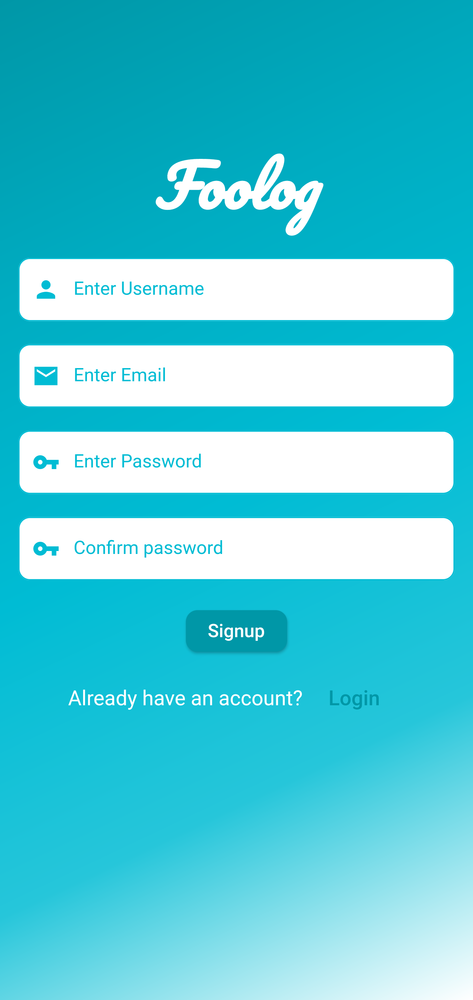
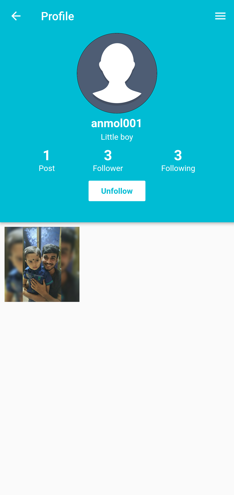

# Foolog
<p>
  
</p>

Foolog is flutter and firebase based mobile app

### Features!
  - Social media platform like instagram
  - User can add/delete/edit post.
  - User can like/dislike other user post.
  - User can search and Follow/Unfollow other user.
  - He can update/delete/edit profile.
  - One to one chat functionality


### Technology Stack
[](https://flutter.dev/docs)
[](https://firebase.google.com/)</br>
[](https://socket.io/)
[](https://developer.android.com/studio "Android studio")


### Screenshots
<table>
  <tr>
    <td><b>Login</b></td>
    <td><b>Signup</b></td>
    <td><b>Home</b></td>
  </tr>  
<tr>
    <td></td>
    <td></td>
    <td></td>
  </tr>  
  <tr>
    <td><b>Add Blog</b></td>
    <td><b>Search</b></td>
    <td><b>Profile Page</b></td>
  </tr> 
  <tr>
    <td></td>
    <td></td>
    <td></td>
  </tr> 
  <tr>
    <td><b>Edit Profile</b></td>
    <td><b>Edit Post</b></td>
    <td><b>Chat List</b></td>
  </tr> 
  <tr>
    <td></td>
    <td></td>
    <td></td>
  </tr> 
   <tr>
    <td><b>Chat Screen</b></td>
    <td><b>Follow</b></td>
    <td><b>Unfollow</b></td>
  </tr>
  <tr>
    <td></td>
    <td></td>
    <td></td>
  </tr> 
</table>

<!-- ### Screenshots
<p float="left">
  
  
  
  
  
  
  
  
  
</p> -->

### Firebase Settings
- Create a new Firebase project and download google-services.json and paste it inside android/app
- Add sha1 key to firebase console to enable Google-SignIn


### Installation

```sh
$ cd Foolog
$ flutter run
```


### Getting Started

For help getting started with Flutter, view our online
[documentation](http://flutter.io/).

For help on editing plugin code, view the [documentation](https://flutter.io/platform-plugins/#edit-code).


### Show some :heart: and star the repo to support the project
