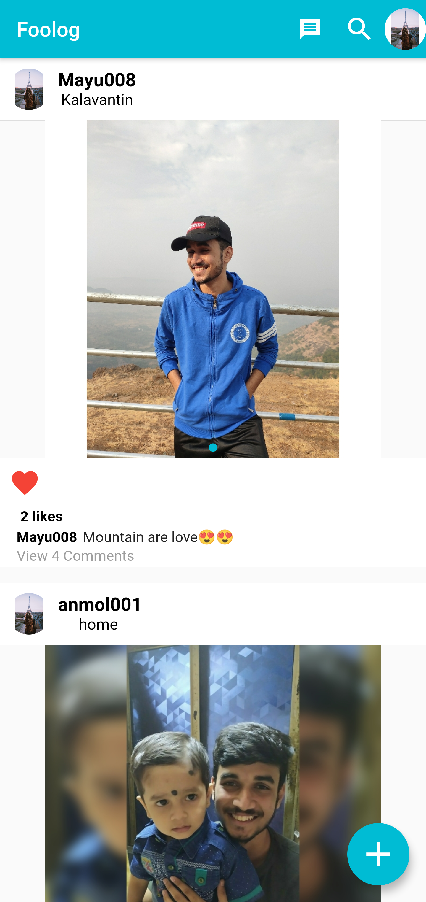
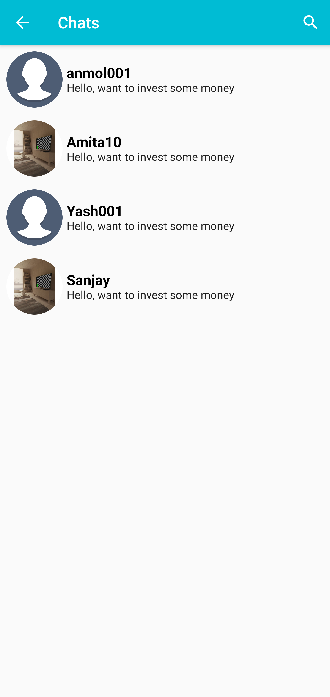

# Foolog

  

Foolog is flutter and firebase based mobile app

### Features!
  - Social media platform like instagram
  - User can add/delete post.
  - User can like/dislike other user post.
  - User can Follow/Unfollow other user.
  - He can update/delete profile/post.

### Technology Stack

### Screenshots

  
  
  
  
  
  
  
  
  

### Firebase Settings
- Create a new Firebase project and download google-services.json and paste it inside android/app
- Add sha1 key to firebase console to enable Google-SignIn

### Show some :heart: and star the repo to support the project
